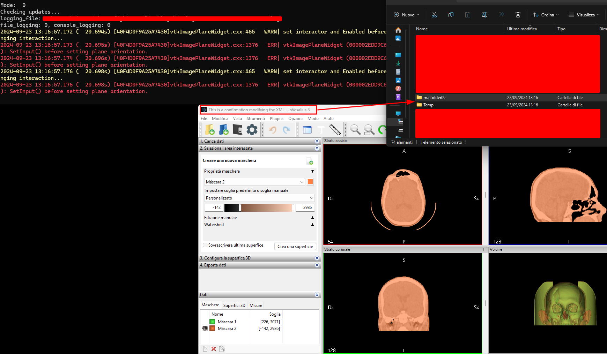

## Overview

A Path Traversal or Directory Traversal vulnerability exists in the .inv3 file import procedure in Invesalius3.

This vulnerability afflicts all versions from 3.1.99995.

The file is a python3 exploit to create a payload for CVE-2024-44825. In particular the exploitation steps of this vulnerability involve the use of a specifically crafted .inv3 (a custom extension for InVesalius) that is indeed a tar file file which, once imported inside the victim's client application allows an attacker to write files and folders on the disk.

----

## Detailed description

Invesalius3 versions from 3.1.99995 to nightly excluded (latest available at the time of writing) contain the following vulnerable function inside the `invesalius/project.py` script file.

```python
def Extract(filename: Union[str, bytes, os.PathLike], folder: Union[str, bytes, os.PathLike]):
    if _has_win32api:
        folder = win32api.GetShortPathName(folder)
    folder = decode(folder, const.FS_ENCODE)

    tar = tarfile.open(filename, "r")
    idir = decode(os.path.split(tar.getnames()[0])[0], "utf8")
    os.mkdir(os.path.join(folder, idir))
    filelist = []
    for t in tar.getmembers():
        fsrc = tar.extractfile(t)
        if fsrc is None:
            raise Exception("Error extracting file")
        fname = os.path.join(folder, decode(t.name, "utf-8"))
        fdst = open(fname, "wb")
        shutil.copyfileobj(fsrc, fdst)
        filelist.append(fname)
        fsrc.close()
        fdst.close()
        del fsrc
        del fdst
    tar.close()
    return filelist

# old one
def Extract_(
    filename: Union[str, bytes, os.PathLike], folder: Union[str, os.PathLike]
) -> List[str]:
    tar = tarfile.open(filename, "r:gz")
    # tar.list(verbose=True)
    tar.extractall(folder)
    filelist = [os.path.join(folder, i) for i in tar.getnames()]
    tar.close()
    return filelist
```
The vulnerability exists in the "Extract" function inside the /invesalius/project.py file, due to the project handling logic.

This function is triggered whenever a new .inv3 file is imported or if is double clicked and th extension is related to invesalius.

In particular, the attacker can create a malicious file and when this file is decompressed (is a tar archive) the traversal vulnerability let the attacker write file on the filesystem at arbitrary location if a folder does not exists.

In the POC one malicious sample folder is written outside of \TEMP and its mktemp location. In addition XML files of them project are modified, but this is not mandatory to have a working exploit.

**Note: ZIP not provided in the repo but they can be obtained from the sample project shipped with invesalius release.**

**Note 2: The fixed version is nightly**

Zip structure is similar to:
```
PS C:\Users\[CHANGEME]\Downloads> gci pers


    Directory: C:\Users\[CHANGEME]\Downloads\pers


Mode                 LastWriteTime         Length Name
----                 -------------         ------ ----
-a----        26/07/2024     14:33           1530 main.plist
-a----        26/07/2024     14:33        7199341 mask_0.dat
-a----        26/07/2024     14:33            909 mask_0.plist
-a----        26/07/2024     14:33        7199341 mask_1.dat
-a----        26/07/2024     14:33            906 mask_1.plist
-a----        26/07/2024     14:33       14155776 matrix.dat
-a----        26/07/2024     14:33            203 measurements.plist
-a----        26/07/2024     14:33             83 poced.bat
-a----        26/07/2024     14:33           1102 poced.bat.lnk
-a----        26/07/2024     14:33            618 surface_0.plist
-a----        26/07/2024     14:33        8903868 surface_0.vtp
-a----        26/07/2024     14:33            614 surface_1.plist
-a----        26/07/2024     14:33        6233263 surface_1.vtp
```


